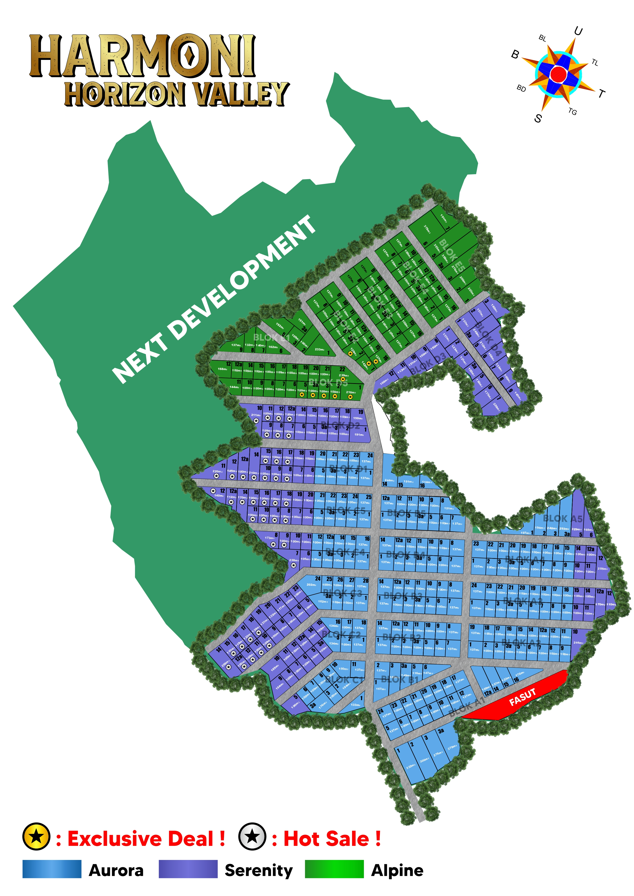
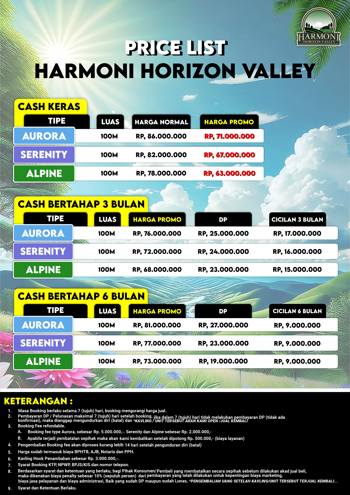

![.][def]

[def]: img/logo.png

[](https://drive.google.com/file/d/1OXtjJNaPGjNL2snWB9MtOt5mJJLwRxYv/view?usp=drive_link)

# Tools Harmoni Horizon Valley

## E-Brocure

[](https://drive.google.com/file/d/1RYMELOmrZVeYaOqdWOrlc2z70RBINCA1/view?usp=drive_link)

## Product Knowledge


```sh
🌿 HARMONI HORIZON VALLEY
✨ Natural Living Meets Modern Comfort ✨

Selamat datang di Harmoni Horizon Valley, project ke-12 dari pengembang terpercaya dengan 11 proyek sukses sebelumnya. Kawasan kavling eksklusif yang memadukan keasrian alam dengan sentuhan modern, menjanjikan pengalaman  dan investasi bernilai tinggi.

🏞 BEAUTY — Daya Tarik Visual Kawasan
Nikmati panorama perbukitan hijau, city light yang memukau di malam hari, dan udara segar yang membebaskan dari hiruk pikuk kota. Lingkungan tertata estetik, nyaman, dan penuh harmoni. Tempat sempurna untuk melepas penat dan membangun masa depan.

🛡 SAFETY — Keamanan yang Tenang di Hati
📑 Legalitas lengkap, surat-surat & pajak sudah termasuk harga
🛡 Dikelola oleh developer berpengalaman — track record 11 proyek selesai sebelumnya:

- Harmoni Alam 1–4
- Harmoni Farm Ville & Spesial Edition
- Harmoni Wooden Ville
- Harmoni Nature Park
- Harmoni Farm House
- The Pangrango Hill

💎 LEGACY — Investasi Aset Jangka Panjang
Ini adalah warisan bernilai untuk keluarga. Tanah terus naik nilainya, dan Harmoni Horizon Valley menawarkan tanah kavling thematic, eksklusif, dan  disimpan, atau diwariskan.

🎯 AREA KOMERSIL & INFRASTRUKTUR
🌈 Rainbow Slide
🚧 Gerbang otomatis
🎠 Playground anak
🛣 Row Jalan Utama 6,5 meter
🛣 Row Jalan Kavling 5,5 meter
🕌 Mushola
🚻 Toilet
🅿 Area parkir luas
⚡ Tiang listrik & PJU

🎁 BONUS ISTIMEWA UNTUK SETIAP PEMBELIAN
✔ 1 Pohon Tabebuya 🌸
✔ 1 Bibit Pohon Mangga 🥭
✔ GRATIS surat-surat & pajak

💰 HARGA MULAI 40 JUTAAN / 10m²
Sangat terjangkau untuk investasi yang indah & bernilai tinggi.

🌄 DESTINASI WISATA TERDEKAT
Liburan kapan saja jadi mudah!

- Curug Citiis
- Curug Niagara
- Sungai Cipamingkis
-  Naga Jonggol
-  Gunung Batu
-  Khayangan
- Kidemang Caffe

📍 Harmoni Horizon Valley — Let the Nature Inspire Your Legacy.
Hubungi kami sekarang dan jadikan kavling eksklusif ini bagian dari cerita hidupmu. 🌳🏡
```

## Siteplane

[](https://drive.google.com/file/d/1V6fQI_e01ge9RjF4RRU48b07PrN7kpw6/view?usp=drive_link)



## Price List

[](https://drive.google.com/file/d/1ZHmyjKiZbEB2GLzhpi-ycEOqHPjwvX0M/view?usp=drive_link)



<!-- ## Siteplane Progres

[](link) [](link)

[](link) [](link) -->

## Other

- **Link Maps**

```sh
https://maps.app.goo.gl/PSv8pXhfACaRH4yz9
```

[](https://t.me/officialharmonihorizonvalley) [](https://t.me/harmonihorizonvalley)
